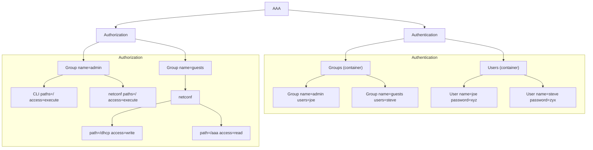

During an AI course the topic of refactoring came up — specifically converting hand-drawn architecture diagrams to something version-controllable. Someone mentioned Gemini handles diagram-to-code tasks well. I had a slide with an AAA (Authentication, Authorisation, Accounting) model drawn as a tree. I gave it to Gemini and asked for Mermaid syntax. The result needed no retouching.

## Why Mermaid over images

A diagram embedded as an image in a markdown file is a binary blob. You cannot diff it, search it, or modify a single label without a graphics tool. Mermaid is plain text. A minor restructuring of the model produces a readable diff that fits naturally in a pull request review.

## The result

Gemini produced this from a screenshot:

Render this in any Mermaid-compatible viewer (GitHub, the Mermaid Live Editor, or a VS Code extension) to see the full tree.

## What worked and what did not

The structure came out correctly in one shot. Label content required minor cleanup — the original image had small text that Gemini inferred reasonably but not perfectly. On a higher-resolution input the output would need no changes at all.

**What you gain:**
- Diffable as plain text in version control.
- Searchable — `grep admin` finds every reference.
- Editable without a drawing tool: change a label, add a node.
- Renders in both light and dark mode without re-exporting.

**What you lose:**
- Layout control. Mermaid's auto-layout can produce crossing edges that a human draughtsman would avoid. For presentation slides you still want a vector drawing tool.

For documentation that engineers read in a code review, Mermaid is the better default. For diagrams that go into a slide deck or a customer document, the image approach is still justified.
